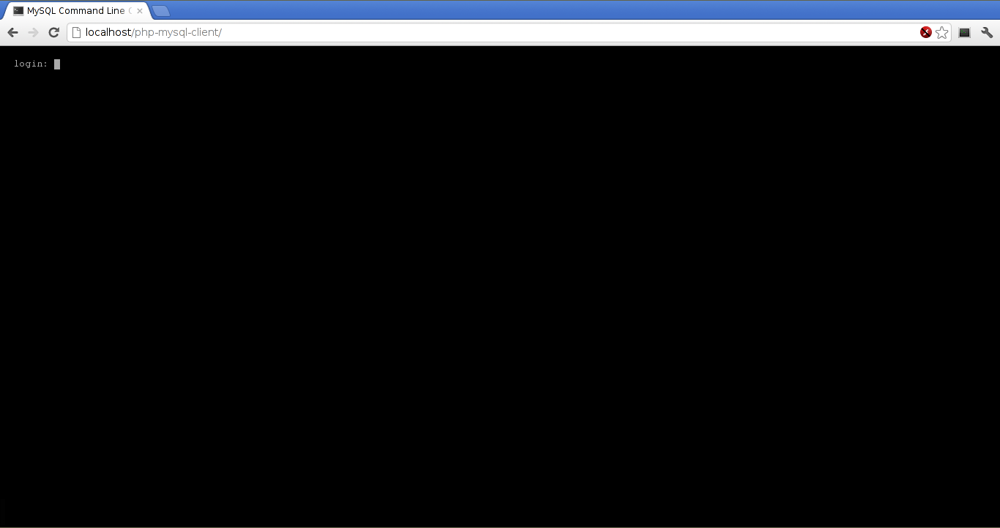
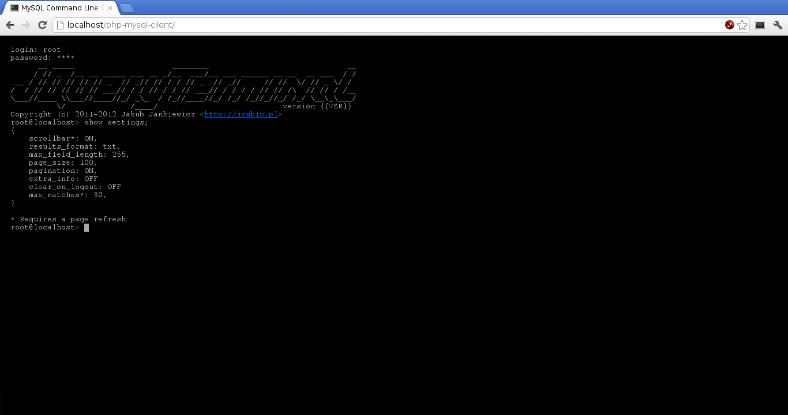
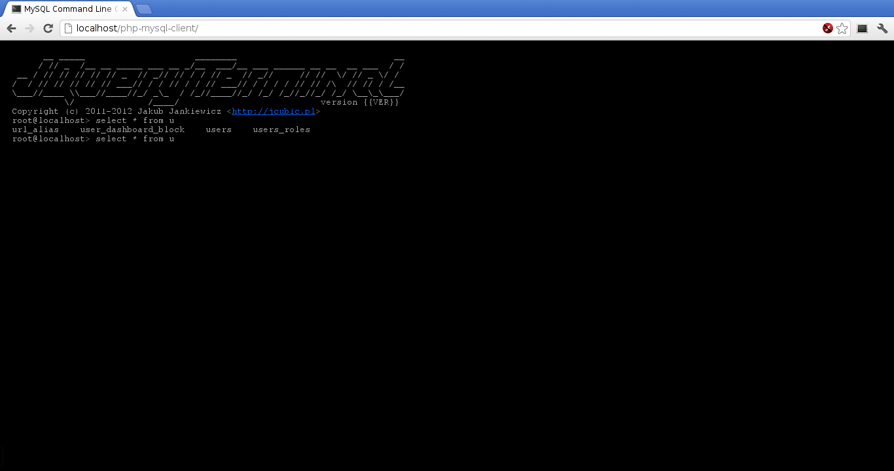

php-mysql-client 0.89
----------------------------------------

MySQL command line client using PHP (like a terminal, but in the browser)

Author: Cosmin Popescu [cosminadrianpopescu at gmail.com]

----------------------------------------

About:
----------------------------------------

This is a free program. You can use it, distribute it, modify it, 
do what ever you want with it. Any suggestions, reclamations, 
bug reports or any other ideas that you may have, please send them
at cosminadrianpopescu at gmail.com

This is a terminal like alternative to phpmyadmin. 

How many times I had only a phpmyadmin tool to connect to a mySQL server? 
Every time I hated it and it transformed my job into a lot of pain. I hate
phpmyadmin. Too many clicks for me and only a simple textarea to input
sql queries. 

I am much more accustomed to the terminal. 

So this is why I developed this little alternative. All you have to do
is put it on your server and you can get rid of phpmyadmin. 

If you are used to the command line client of mySQL, and you prefer
it over phpmyadmin, then this is a solution to connect to the servers
opened only for localhost. 


Requirements:
----------------------------------------

PHP 5.3
Apache 2.0
mysql 5


Installation and configuration:
----------------------------------------

To install it, simply copy the content of the archive to any apache root. 
Once deployed, just access the page (for example http://localhost/php-mysql-client). 

You might be required to create a virtual host in your apache configuration file, 
depending on where you deploy it. 

If you can in stall a phpmyadmin on the server, then you can put this terminal
next to the phpmyadmin. 

The mysql client does not require any configuration. Once deployed, simply access it
and in the login type the credentials (user@host:port). You can only specify the user. 
In this case the default server will be localhost and the default port will be 3306
(this is the usual configuration for phpmyadmin). 

You can also edit the config.php file and define the array allowed_ips and allowed_hosts. 
If you do this, then you will only be able to connect from the specified IP's or the specified
hosts. Please note that if both are defined, only the IP is checked.


Screenshots
----------------------------------------

* Log in


* Settings


* Autocomplete


Special thanks:
----------------------------------------

Many thanks to jcubic (http://jcubic.pl/) for developing the jquery terminal
plugin. 


Features:
----------------------------------------

    * autocomplete (once you selected a database, you will have autocomplete for table names and
      columns in queries)


Plugins
----------------------------------------

There are two types of plugins that can be developed: 

    * plugins that modify the command (the pre_run_plugins)
    * plugins that modify the output (the post_run_plugins)

To develop a new plugin, you need to create a javascript file with a function, which will 
receive as a parameter either the sql command, or the result from the server. Then include this
file in the index.html. 

Then, in the settings file, add the plugin in the pre_run_plugins or post_run_plugins array. 
Please do not remove the check_command plugin. 

For an example, see the drupal-plugin.js. This is a little plugin that I use it for Drupal
development. It replaces all the tables between accolades either with the value found between the
accolades, or if the pref variable is set in get, with the prefix followed by what is found
betweeen accolades.


Settings
----------------------------------------

There are several settings for the application: 

    * scrollbar (boolean) - If set, then the results will be displayed with a horizontal scrollbar
      DEFAULT: on
    * results_format (string) - This indicates the format in which the results are displayed. For
      the moment only txt (do not modify). 
      DEFAULT: txt
    * max_field_length (integer) - The maximum number of characters to be displayed for each column
      in a result set. You can enable extra info option to see all the text in a column
      DEFAULT: 255
    * page_size (integer) - The number of rows after which the table header of a result set will be 
      displayed again (especially usefull if you have many rows in results sets). 0 means that the
      header will be displayed only once in at the beggining of the result set. 
      DEFAULT: 100
    * pagination (boolean) - If set, then only the first [page_size] results will be displayed wit a 
      link for the next page. Of course, if this is set and the page_size is 0, then all the results
      are displayed all the time. 
      DEAFULT: on
    * extra_info (boolean) - If set, before each row there will be a link to display all the data from 
      the row
      DEAFULT: on
    * clear_on_logout (boolean) - If set, the command history is cleared on logout. 
      DEFAULT: off
    * max_matches (integer) - This is the maximum number of matches that are displayed in a completion
      with tab. If there are more matches, then a link to see all matches is displayed. 
      DEAFULT: 30

Configuration
----------------------------------------

Check the `config.php` file for how to limit the access to the application. 

There is no need to set up the preferences in the settings.js file. After you connect to the server
from the browser, you can set up the variables by typing in the prompt settings.[setting_name] = value. 

For example, if you want to change the page_size, you type: 
    settings.page_size = 50; <cr>

Please note that all the commands must be ended with a semi column. 

To view all the current settings, just type: 
    show settings; <cr>


Import / Export
----------------------------------------

To export the current database, you can use the command export. Please note that this requires
system access to the mysqldump binary file (this will execute mysqldump on the system). So, if
you cannot execute mysqldump from your php environment, then you will not have any export 
facilities for the moment. 

Syntax:

```
    export pattern_expr [no routines | no data | with mysqldump in location_pattern] into location_pattern; 
    
    pattern_expr: ['|"]string['|"]
        string is a regular expression pattern (all the tables matching this pattern will be exported)
    location_pattern: ['|"]string['|"]
        string is a location on the server hard drive
```

For example, to export all the tables from the current database, if the mysqldump binary is located in 
/opt/mysql/bin and you don't want to export the stored routines: 
    `export '.*' no routines with mysqldump in '/opt/mysql/bin' into
'/tmp/backup.sql'; <cr>`

To import an sql file, first you have to upload the file on the server. Once the file it's uploaded, then
you have to use the import command. 

Syntax: 

```
    import location_pattern; 
    location_pattern: ['|"]string['|"]
        string is a location on the server hard drive
```

So, for example, if you uploaded the restore.sql file in the /srv/http/uploads folder, you execute: 
    `import '/srv/http/uploads/restore.sql';<cr>`

Predefined connections strings
----------------------------------------

You can use the connection.js file to jave predefined connection strings.
Example: 

```
var connections = {
	mysqlLocalhost = 'mysql://root@localhost:3306'
}
```

If you copy / paste this in the `connections.js` file, then you can use at
login `:mysqlLocalhost`. This will be replaces with the string that you have
in `mysqlLocalhost` variable. 

You can also connect to other databases. The format is as follows: 

`oracle://user@host:port?SID=sid`

or 

`oracle://user@host:port?SERVICE_NAME=service`

There is another oracle predefined client. If you want to implement your own
database type, then create another class which will extend the DbClient class
and implement the abstract methods. 

Limitations: 
----------------------------------------

* No transactions support. 
